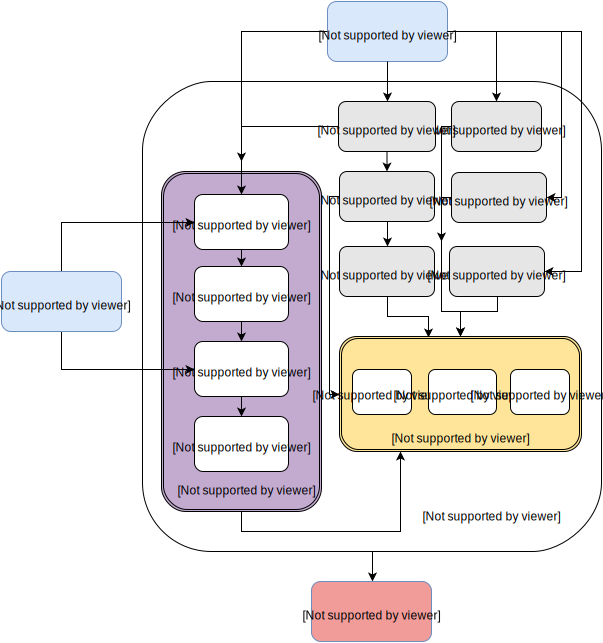
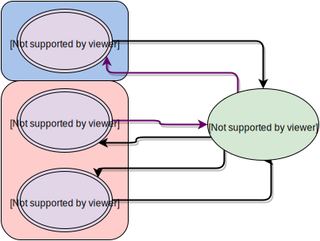
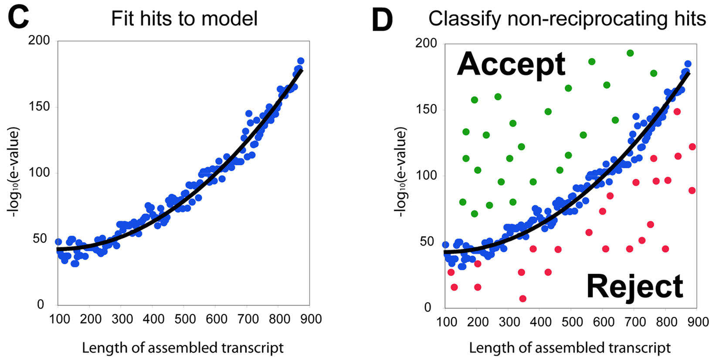

# About

This page goes a little more in depth on the software and its goals.

## Motivations

Several different factors motivated dammit's development. The first of
these was the sea lamprey transcriptome project, which had annotation as
a primary goal. Many of dammit's core features were already implemented
there, and it seemed a shame not share that work with others in a usable
format. Related to this was a lack of workable and easy-to-use existing
solutions; in particular, most are meant to be used as protocols and
haven't been packaged in an automated format. Licensing was also a big
concern -- software used for science should be open source, easily
accessible, remixable, and free.

Implicit to these motivations is some idea of what a good annotator
*should* look like, in the author's opinion:

1.  It should be easy to install and upgrade
2.  It should only use Free software
3.  It should make use of standard databases
4.  It should output in reasonable formats
5.  It should be relatively fast
6.  It should try to be correct, insofar as any computational approach
    can be "correct"
7.  It should give the user some measure of confidence for its results.

## The Obligatory Flowchart

## Software Used

-   TransDecoder
-   BUSCO
-   HMMER
-   Infernal
-   LAST
-   crb-blast (for now)
-   pydoit (under the hood)

All of these are Free Software, as in freedom and beer

## Databases

-   Pfam-A
-   Rfam
-   OrthoDB
-   BUSCO databases
-   Uniref90
-   User-supplied protein databases

The last one is important, and sometimes ignored.

## Conditional Reciprocal Best LAST

Building off Richard and co\'s work on Conditional Reciprocal Best
BLAST, I've implemented a new version with Python and LAST -- CRBL.
The original lives [here](https://github.com/cboursnell/crb-blast).

Why??

-   BLAST is too slooooooow
-   Ruby is yet another dependency to have users install
-   With Python and scikit learn, I have freedom to toy with models (and
    learn stuff)

And, of course, some of these databases are BIG. Doing `blastx` and
`tblastn` between a reasonably sized transcriptome and Uniref90 is not
an experience you want to have.

ie, practical concerns.

## A brief intro to CRBB

-   Reciprocal Best Hits (RBH) is a standard method for ortholog
    detection
-   Transcriptomes have multiple multiple transcript isoforms, which
    confounds RBH
-   CRBB uses machine learning to get at this problem

CRBB attempts to associate those isoforms with appropriate annotations
by learning an appropriate e-value cutoff for different transcript
lengths.

*from
http://journals.plos.org/plosgenetics/article?id=10.1371/journal.pgen.1004365\#s5*

## CRBL

For CRBL, instead of fitting a linear model, we train a model.

-   SVM
-   Naive bayes

One limitation is that LAST has no equivalent to `tblastn`. So, we find
the RBHs using the TransDecoder ORFs, and then use the model on the
translated transcriptome versus database hits.
